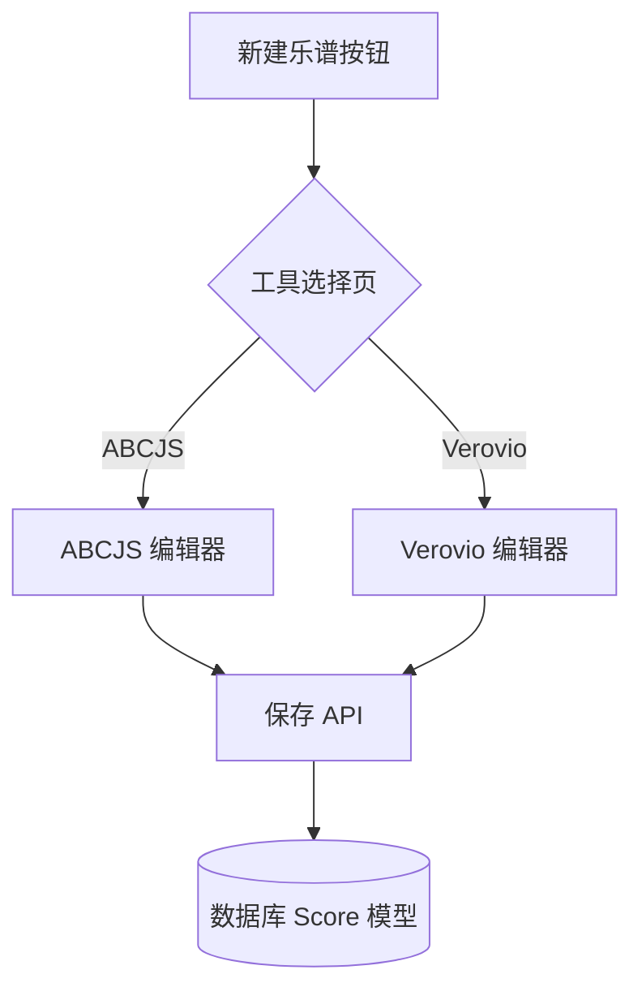

## 产品概述

在乐谱创作流程中引入“工具选择”环节，允许用户在 ABCJS 和 Verovio Toolkit 两种渲染引擎之间进行选择。同时，实现一个全新的基于 Verovio 的专业乐谱编辑器，支持更复杂的乐谱排版和渲染需求。

## 核心功能

- **工具选择页面**：用户点击“新建乐谱”后，展示选择卡片（ABCJS vs Verovio），包含各引擎的特点描述。
- **Verovio 编辑器**：支持 MEI (Music Encoding Initiative) 格式输入，实时渲染高质量乐谱 SVG。
- **编辑器功能增强**：提供缩放控制、页面翻页、以及基于 Verovio Toolkit 的基础排版设置。
- **后端模型升级**：乐谱数据模型增加 `notationType` 字段，以区分和存储不同引擎生成的乐谱内容。
- **统一保存机制**：无论使用哪种编辑器，均通过统一的接口进行保存，并保留其引擎属性。

## 视觉效果

- **选择页**：采用现代玻璃拟态样式的卡片，悬停时伴随平滑的缩放和阴影加深效果，辅以直观的图标。
- **编辑器界面**：双栏布局，左侧为深色调的代码编辑区（支持语法高亮），右侧为纯净白色的乐谱预览区，分界线可自由拖拽。

## 技术栈

- **前端框架**: React + TypeScript
- **样式处理**: Tailwind CSS
- **核心库**: `verovio` (WebAssembly toolkit)
- **代码编辑器**: Monaco Editor (或轻量级 react-simple-code-editor)
- **状态管理**: React Context 或 Zustand

## 系统架构

### 模块划分

- **Selection Module**: 负责分发创建流程，根据用户选择导航至对应的编辑器路径。
- **Verovio Editor Module**: 独立组件，集成 Verovio Toolkit 加载、MEI 解析与 SVG 渲染。
- **Storage Service**: 抽象的 API 层，处理 Score 模型中新增字段的序列化与持久化。

### 数据流



## 关键代码结构

### 乐谱数据模型扩展

```typescript
interface Score {
  id: string;
  title: string;
  content: string;
  notationType: 'abcjs' | 'verovio';
  updatedAt: string;
}
```

### Verovio 渲染逻辑

```typescript
class VerovioService {
  private vrvToolkit: any;
  async init() { /* 加载 WASM */ }
  render(meiContent: string, options: object): string { 
    return this.vrvToolkit.renderToSVG(meiContent, options);
  }
}
```

## 设计风格

整体沿用简约专业的设计语言。工具选择页面强调引导性，通过对比强烈的图标区分 ABCJS（轻量、简单）与 Verovio（专业、复杂）。编辑器界面强调生产力，采用典型的 IDE 布局，最大化利用屏幕空间进行乐谱展示。

## Agent Extensions

### SubAgent

- **code-explorer**
- Purpose: 探索现有项目中 ABCJS 编辑器的实现方式，包括数据流、保存逻辑和组件结构。
- Expected outcome: 深入理解现有架构，确保新添加的 Verovio 编辑器与之保持风格和逻辑上的一致性。