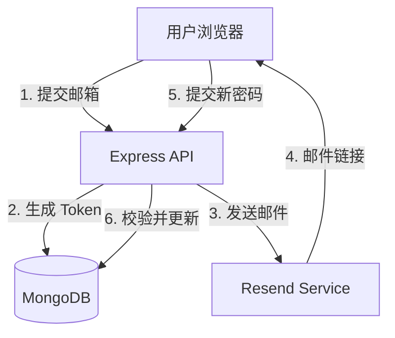

## 产品概述

为音乐记谱应用实现完整的“忘记密码”与“重置密码”功能。该功能允许用户在丢失凭据时，通过已验证的电子邮箱安全地找回账户访问权限。

## 核心功能

- **发送重置请求**：前端提供找回密码页面，用户输入邮箱后触发后端生成带有时效性的加密 Token，并存储于数据库中。
- **重置邮件通知**：集成 Resend 服务，向用户发送包含唯一重置链接的精美 HTML 邮件。
- **凭据验证与更新**：用户通过邮件链接进入重置页面，后端验证 Token 有效性（未过期且匹配），允许用户设置新密码并清除 Token。
- **反馈与重定向**：操作完成后提供清晰的成功/失败视觉提示，并引导用户重新登录。

## 技术栈

- **后端**：Node.js + Express.js + MongoDB (Mongoose)
- **前端**：React + TypeScript + Tailwind CSS (shadcn/ui)
- **邮件服务**：Resend
- **安全性**：Crypto (生成 Token), Argon2/bcrypt (密码哈希)

## 技术架构

### 系统架构



### 模块划分

- **Auth Controller**: 扩展 `forgotPassword` 和 `resetPassword` 逻辑。
- **Mail Service**: 封装 Resend 逻辑，新增密码重置邮件模板。
- **User Model**: 扩展 `resetPasswordToken` 和 `resetPasswordExpires` 字段。
- **Frontend Pages**: 新增 `ForgotPassword` 和 `ResetPassword` 视图组件。

## 实施细节

### 目录结构

```
project-root/
├── src/
│   ├── backend/
│   │   ├── models/
│   │   │   └── User.js          # 修改：增加重置相关字段
│   │   ├── controllers/
│   │   │   └── authController.js # 新增：密码重置逻辑
│   │   └── services/
│   │       └── emailService.js  # 修改：增加重置邮件模板
│   └── frontend/
│       ├── pages/
│       │   ├── ForgotPassword.tsx # 新增
│       │   └── ResetPassword.tsx  # 新增
│       └── components/
│           └── auth/            # 更新：AuthContext 集成
```

### 核心代码结构

```typescript
// User 模型扩展定义
interface IUserUpdate {
  resetPasswordToken?: string;
  resetPasswordExpires?: Date;
}

// 邮件发送接口
interface IPasswordResetEmail {
  to: string;
  resetUrl: string;
}
```

## 设计方案

设计风格保持与现有“音乐记谱”应用的一致性，追求简洁、专业且具有呼吸感的现代主义风格。

- **找回密码页**：采用单卡片布局，居中展示。包含邮箱输入框和“发送链接”按钮。背景使用柔和的渐变或记谱元素的线性底纹。
- **重置密码页**：增加密码强度校验提示。双输入框（新密码、确认密码）设计，确保用户输入准确。
- **交互动效**：按钮点击后的 Loading 状态，以及操作成功后的绿色 Check 动画提示。

## 代理扩展

### SubAgent

- **code-explorer**
- 目的：深入探索当前 `AuthContext`、`User` 模型及 `Resend` 的具体配置。
- 预期结果：确保新增的忘记密码逻辑与现有注册登录流程无缝集成，避免重复代码或架构冲突。