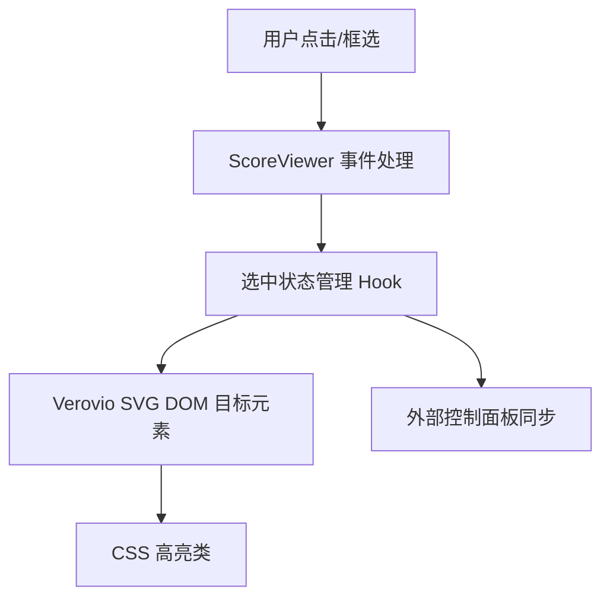
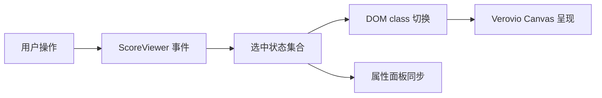

## Product Overview

Verovio 乐谱查看器中的选中逻辑应仅突出当前目标音符、连线或符号，避免整段 SVG 统一着色，同时维持清晰对比度。

## Core Features

- 细粒度元素选中：交互事件只为触发元素添加高亮标记，其他元素保持原样，支持多选。
- 非填充式高亮：通过描边、外框或阴影方式凸显被选元素，确保乐谱内容仍可阅读。
- 状态同步反馈：高亮状态与外层控制面板（如属性侧栏）一致更新，快速反查当前选中元素。

## Tech Stack

- 复用现有 React + Verovio 前端框架，基于 ScoreViewer.jsx 等组件修改
- CSS/SCSS 层通过局部变量与 class 控制填充、描边样式
- 事件逻辑仍走 Verovio 渲染器与内部状态管理

## Tech Architecture

### 系统结构



### 模块划分

- **事件处理模块**：接管 click/drag 事件，定位 SVG 元素 ID，调用状态管理；依赖 Verovio 渲染实例。
- **选中状态模块**：维护当前选中元素集合，向 UI 与样式暴露状态；提供增删、清空接口。
- **渲染样式模块**：根据选中状态为精确元素附加 class，CSS 定义描边/外框效果；依赖状态模块输出。
- **外部同步模块**：监听状态变化，更新属性面板或其他组件显示；依赖状态模块。

### 数据流



## 实施细节

### 目录结构（新增/改动）

```
music-notation/
├── src/components/ScoreViewer.jsx      # 调整事件处理与 class 策略
├── src/hooks/useSelectionState.js      # 新建/强化选中状态 Hook
├── src/styles/score-viewer.css         # 更新精准高亮样式
```

### 关键代码结构

```typescript
// 选中状态定义
type SelectionTarget = { id: string; type: 'note' | 'rest' | 'beam' | 'tie' };

// Hook 接口
interface SelectionState {
  selected: SelectionTarget[];
  toggle(target: SelectionTarget): void;
  clear(): void;
  isSelected(id: string): boolean;
}
```

### 技术实现计划

1. **问题**：现有 CSS 全局覆盖 fill/stroke。

- **方案**：移除全局覆盖，仅在选中元素 class (.vrv-selected) 中定义描边/阴影。
- **步骤**：清理样式 → 定义渐变描边 → 验证对比度。
- **测试**：检查单选、多选、反选视觉效果。

2. **问题**：事件逻辑无法定位具体元素。

- **方案**：使用事件冒泡中 SVG target 的 data-id 对应 Verovio element ID。
- **步骤**：读取 target.dataset.id → 映射到 SelectionTarget → 更新 Hook。
- **测试**：点击不同符号，控制台与 UI 同步。

3. **问题**：状态未与外部控件同步。

- **方案**：暴露选中数组给父组件，通过 props/Context 触发面板更新。
- **步骤**：在 ScoreViewer props 中新增 onSelectionChange → 调用时传 selected。
- **测试**：外部面板展示正确元素信息。

### 集成要点

- DOM class 命名遵循 `.vrv-element` 基类，新增 `.is-selected`.
- 组件通信采用 JSON 对象 `{ id, type }`.
- 保持现有授权与渲染配置不变。

## 性能与安全

- 优化：限制重渲染范围，使用 requestAnimationFrame 批量更新 class。
- 安全：对传入 ID 做校验，避免注入；事件处理内阻止默认冒泡造成误触。
- 可扩展：选中集合以 Map 结构实现，便于未来添加分组或区段高亮。

## Agent Extensions

- **code-explorer**
- Purpose: 快速遍历 ScoreViewer 及样式文件，定位 fill/stroke 覆盖逻辑与事件绑定
- Expected outcome: 输出涉及选中高亮的文件及关键代码段，支撑后续精确修改