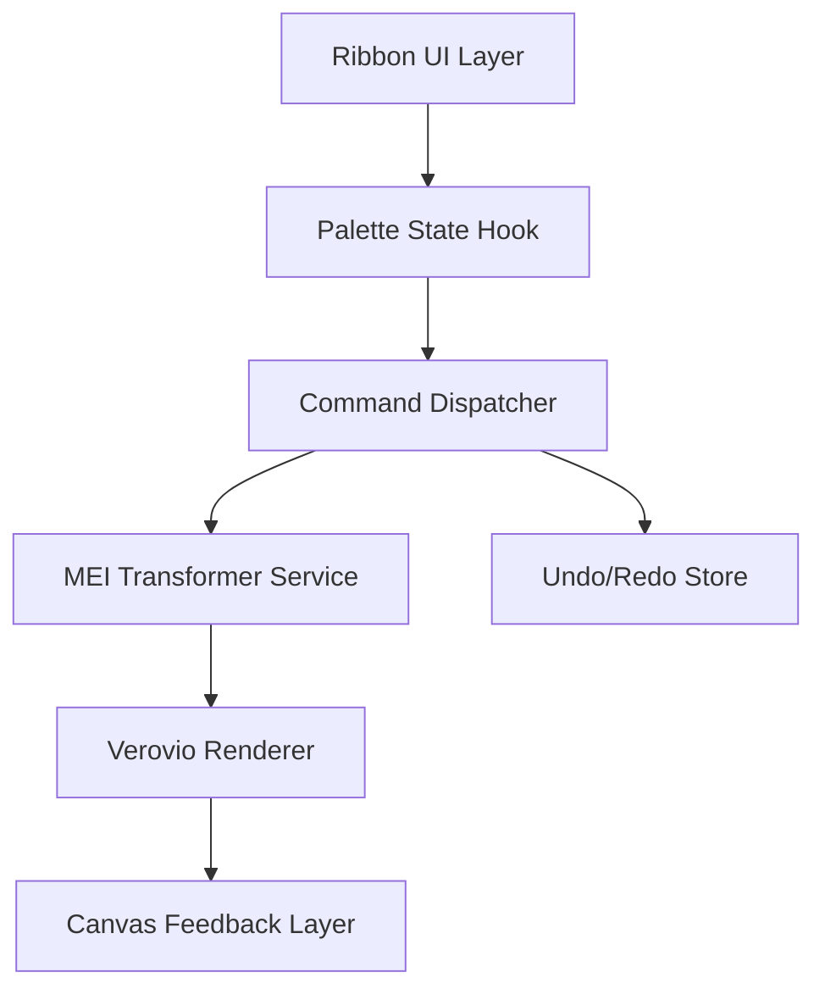
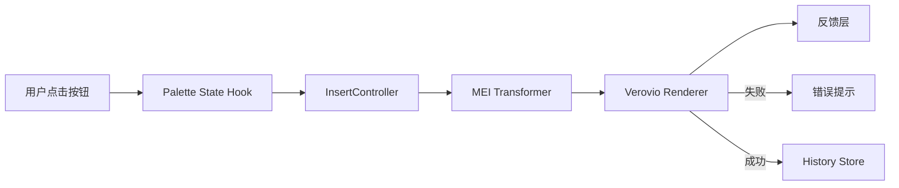

## Product Overview

- 为 Verovio 作曲页面打造固定在顶栏的功能区式调色板，并保证片段插入逻辑能将 MEI 事件写入画布从而正确渲染音符  
- 强化按钮分组、状态提示与插入反馈，让用户获得接近文字处理器的连贯体验

## Core Features

- **功能区调色板**：多分组按钮固定于画布上方，支持折叠、悬浮提示与选中高亮，提升指令发现性与视觉秩序  
- **可靠片段插入**：点击片段后在光标位置创建对应 MEI 片段，附带校验与提示，确保音符即时出现在谱面上

## Tech Stack

- 前端：React + TypeScript + Tailwind（复用现有项目栈）  
- 乐谱引擎：Verovio Toolkit  
- 状态管理与服务：React Context + 自定义 hooks 处理调色板状态与 MEI 插入  
- 测试：React Testing Library + Jest 针对 UI 与插入逻辑单测

## 架构设计



- Ribbon UI Layer：承载多标签按钮、收纳控件  
- Palette State Hook：集中管理激活分组、禁用状态  
- Command Dispatcher：解析按钮意图与片段元数据  
- MEI Transformer Service：将片段 JSON 映射为 MEI 节点并插入 DOM  
- Verovio Renderer：重渲染并将错误回传至反馈层  
- Undo/Redo Store：记录插入操作以便快速撤销

## 模块划分

- **RibbonLayout 模块**：按钮栅格、分组切换、固定定位；依赖 Palette State Hook  
- **SnippetCatalog 模块**：维护片段元数据、搜索与过滤；暴露 getSnippet(id)  
- **InsertController 模块**：集中处理指令→MEI 的转换；依赖 Transformer Service 与 Verovio API  
- **Feedback & History 模块**：展示状态提示、维护撤销栈；监听 InsertController 事件

## 数据流



- 失败路径提供错误文案与按钮禁用  
- 成功路径将快照推入 History，供撤销使用

## 目录结构（增量）

```
music-notation/
├── src/
│   ├── components/
│   │   └── RibbonPalette/
│   │       ├── index.tsx
│   │       └── RibbonGroup.tsx
│   ├── hooks/
│   │   └── usePaletteState.ts
│   ├── services/
│   │   ├── snippetCatalog.ts
│   │   └── meiTransformer.ts
│   ├── controllers/
│   │   └── insertController.ts
│   └── types/
│       └── snippet.ts
```

## 关键代码结构

- `SnippetMeta { id: string; label: string; voice: number; mei: string | SnippetRecipe; }`  
- `usePaletteState(): { activeTab, pinned, selectCommand(cmdId) }`  
- `InsertController.execute(snippetId, caretInfo): Promise&lt;InsertResult&gt;`  
- `transformSnippet(snippetMeta, caretInfo): SerializedMEINode`

## 技术实现计划

1. **固定式功能区布局**  

- 解决：当前调色板随滚动消失且分组混乱  
- 方法：CSS sticky + grid + 动画切换  
- 步骤：分析现状 → 设计栅格 → 实现 tabs ↔ groups → 添加响应式规则  
- 测试：快照/交互测试确认固定与折叠正常

2. **按钮状态与提示**  

- 解决：多次点击无反馈  
- 方法：hover/active 样式 + 工具提示 + 禁用逻辑  
- 步骤：定义状态机 → 绑定按钮 → 接入反馈 store → 编写可访问提示  
- 测试：ARIA、可交互性测试

3. **可靠 MEI 插入**  

- 解决：点击片段未生成音符  
- 方法：统一在 InsertController 中处理 caret、voice、measure，成功后触发 rerender  
- 步骤：梳理光标 API → 编写 transformer → 集成撤销栈 → 加入错误捕获  
- 测试：插入、撤销、异常分支单测

## 集成说明

- 与 Verovio API 交互采用 JSON 指令；插入成功后触发 `renderData()`  
- Undo/Redo 使用现有 store（若有）或轻量队列  
- UI 事件通过 Context 分发，避免跨层事件传递

## 性能与安全

- Ribbon 按需渲染分组，使用 memo 减少重绘  
- 插入操作前校验片段与光标位置，预防错误 MEI  
- 错误日志沿用项目 Logger

## 可扩展性

- Ribbon 支持后续新分组；SnippetCatalog 以配置驱动，可追加 JSON 定义  
- InsertController 与 Transformer 解耦，方便多种乐器或记谱法扩展

### 页面：作曲工作区  

- **Top Ribbon Block**：固定透明渐变背景，分组标签+按钮栅格，hover 微动效  
- **Snippet Filter Block**：Ribbon 下的搜索与标签筛选，玻璃拟态输入框  
- **Score Canvas Block**：占据主体，背景淡灰，提供缩放与光标指示器  
- **Feedback & History Block**：底部浮层展示状态、撤销/重做按钮  
- **Context Panel Block**：右侧显示当前片段参数，可编辑并即时反映  
整体采用玻璃拟态+高对比色，按钮带图标与快捷键提示，响应式布局兼顾大屏

## 可用扩展

- **code-explorer（SubAgent）**
- Purpose: 快速遍历 music-notation 仓库，定位调色板与片段插入相关文件
- Expected outcome: 收集现有 UI 与插入逻辑上下文，指导改造方案